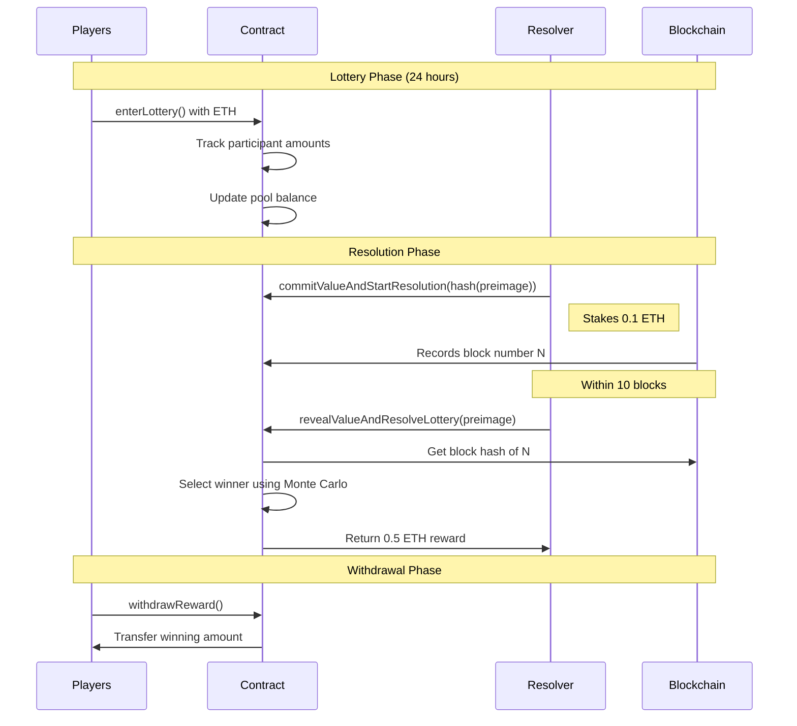
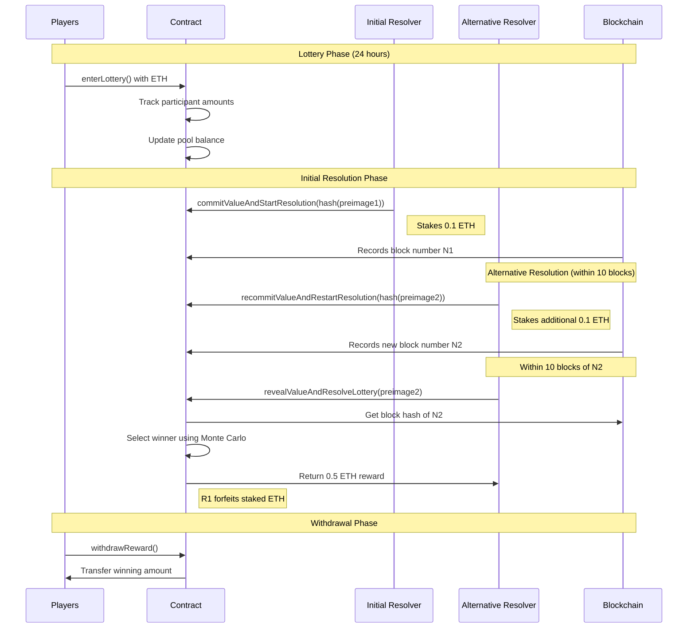

[//]: # (Badges)


[](https://github.com/zarnoevic/pure-lottery/actions/workflows/build.yml)
[](https://github.com/zarnoevic/pure-lottery/actions/workflows/tests.yml)

# Building a Fair Decentralized Lottery

This project started as an experiment in creating a truly fair lottery system on Ethereum. The key insight was that by making resolution open to anyone and providing economic incentives, we can ensure the lottery always completes without requiring trust in any central party.

## How it Works

The lottery runs in 24-hour cycles. During this time, players can enter by sending ETH to the contract. Once the time is up, anyone can trigger the resolution process - this is where it gets interesting.

To resolve the lottery, someone (we call them a resolver) needs to:
1. Generate a random number and commit its hash
2. Put up a 0.1 ETH stake
3. Reveal their number in the next 10 blocks

The contract combines this revealed number with a future block hash to generate the winning ticket. If the resolver completes this process honestly and on time, they earn 0.5 ETH (5x their stake). If they try to game the system by not revealing their number, anyone else can jump in with a new number, and the first resolver loses their stake.

## The Code

### Smart Contract

The core of the system lives in `PureLottery.sol`. Here's what makes it tick:

- Players enter by sending ETH
- The contract tracks everyone's ticket amounts
- Resolvers commit hashed numbers and stake ETH
- A Monte Carlo selection picks the winner based on stake size
- Winners can withdraw their prizes anytime
- New lotteries start automatically

### Resolver Bot 

We built a TypeScript bot (`resolver-bot.ts`) that monitors the blockchain and automatically participates in resolution. It:
- Watches for completed lottery rounds
- Generates truly random numbers using Node's crypto library
- Commits and reveals values at the right times
- Collects rewards for successful resolutions

It's designed to be profitable to run while ensuring fair lottery outcomes.

## The Resolution Dance

Here's what resolution looks like when everything goes smoothly (mermaid diagram):



But sometimes a resolver might try to game the system. Here's how another resolver can step in:



## Why This Works

The beauty of this system is that it aligns everyone's incentives:
- Players get a fair lottery
- Resolvers make money for ensuring fairness
- Bad actors lose their stakes
- No one can predict or manipulate the outcome

We essentially created a market for lottery resolution where being honest is the most profitable strategy.

## Running Your Own Resolution Bot

Want to earn some ETH by keeping lotteries fair? Here's what you need:

1. An Ethereum node (Infura works great)
2. A wallet with some ETH for staking
3. Node.js installed

Set up your environment:
```bash
export RPC_URL="your_node_url"
export PRIVATE_KEY="your_wallet_key"
export LOTTERY_ADDRESS="deployed_contract_address"
```

Install dependencies and run:
```bash
npm install ethers
ts-node resolver-bot.ts
```

The bot will watch for resolution opportunities and automatically participate when profitable.